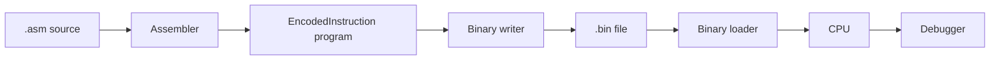

# Architecture

## Module Overview

```text
include/
src/
tests/
examples/
```

The `include/` and `src/` directories are intentionally flat. Each subsystem has one public header and one implementation file where applicable.

## Execution Flow

```text
Fetch -> Decode -> Execute
```



## Core Types

### OpCode

Enum of all supported instructions.

### EncodedInstruction

```cpp
struct EncodedInstruction {
    uint8_t opcode;
    uint8_t a;
    int16_t b;
};
```

Each instruction is encoded as 4 bytes.

## Modules

### CPU

Responsibilities:
- execute instructions
- maintain registers
- update PC/SP
- update flags
- manage halted state

### Memory

Responsibilities:
- read/write bytes
- read/write signed 32-bit words
- read/write encoded instructions
- enforce memory bounds

### Assembler

Responsibilities:
- parse assembly text
- ignore comments and blank lines
- resolve labels to byte addresses
- encode instructions
- report line-numbered assembly errors

### Binary Program Format

Responsibilities:
- write assembled programs to versioned binary files
- validate binary headers
- load binary files back into `EncodedInstruction` programs

### Debugger

Responsibilities:
- single-step execution
- continue until halt, breakpoint, or step budget
- breakpoint management
- register and memory dumps
- execution tracing
- deterministic CLI debug output for binary programs
